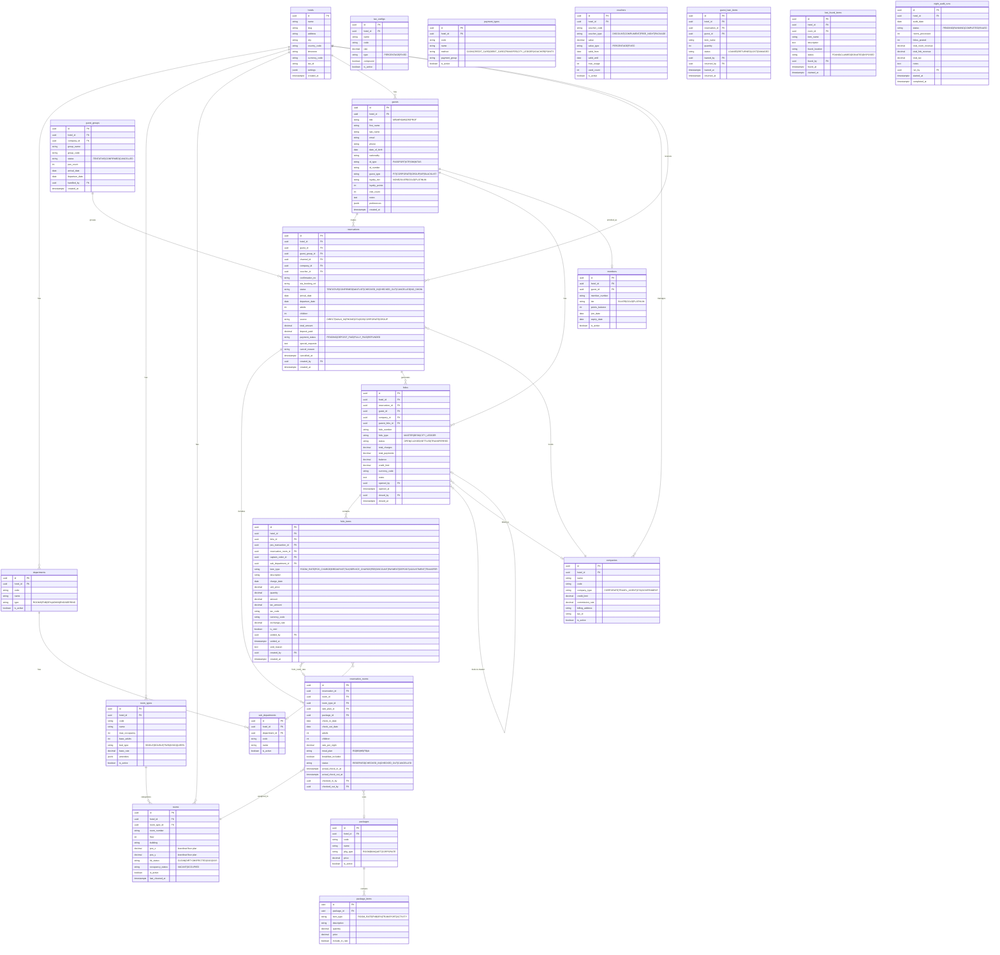

# 03 — ERD Part 1: Core & Alava PMS

Mencakup entitas: Hotels, Departments, Companies, Room Management,
Guest & Reservation, Folio & Billing, Night Audit.

```mermaid
erDiagram

  %% ════════════════════════════════
  %% CORE
  %% ════════════════════════════════

  hotels {
    uuid        id              PK
    string      name
    string      slug
    string      address
    string      city
    string      country_code
    string      timezone
    string      currency_code
    string      tax_id
    jsonb       settings
    timestamptz created_at
  }

  departments {
    uuid        id              PK
    uuid        hotel_id        FK
    string      code
    string      name
    string      type            "ROOMS|FNB|SPA|ADMIN|ENGINEERING"
    boolean     is_active
  }

  sub_departments {
    uuid        id              PK
    uuid        hotel_id        FK
    uuid        department_id   FK
    string      code
    string      name
    boolean     is_active
  }

  tax_configs {
    uuid        id              PK
    uuid        hotel_id        FK
    string      name
    string      code
    decimal     rate
    string      type            "PERCENTAGE|FIXED"
    boolean     compound
    boolean     is_active
  }

  companies {
    uuid        id              PK
    uuid        hotel_id        FK
    string      name
    string      code
    string      company_type    "CORPORATE|TRAVEL_AGENT|OTA|GOVERNMENT"
    decimal     credit_limit
    decimal     commission_rate
    string      billing_address
    string      tax_id
    boolean     is_active
  }

  payment_types {
    uuid        id              PK
    uuid        hotel_id        FK
    string      code
    string      name
    string      method          "CASH|CREDIT_CARD|DEBIT_CARD|TRANSFER|CITY_LEDGER|VOUCHER|POINTS"
    string      payment_group
    boolean     is_active
  }

  %% ════════════════════════════════
  %% ROOM MANAGEMENT
  %% ════════════════════════════════

  room_types {
    uuid        id              PK
    uuid        hotel_id        FK
    string      code
    string      name
    int         max_occupancy
    int         base_adults
    string      bed_type        "SINGLE|DOUBLE|TWIN|KING|QUEEN"
    decimal     base_rate
    jsonb       amenities
    boolean     is_active
  }

  rooms {
    uuid        id              PK
    uuid        hotel_id        FK
    uuid        room_type_id    FK
    string      room_number
    int         floor
    string      building
    decimal     pos_x           "koordinat floor plan"
    decimal     pos_y           "koordinat floor plan"
    string      hk_status       "CLEAN|DIRTY|INSPECTED|OOO|OOS"
    string      occupancy_status "VACANT|OCCUPIED"
    boolean     is_active
    timestamptz last_cleaned_at
  }

  packages {
    uuid        id              PK
    uuid        hotel_id        FK
    string      code
    string      name
    string      pkg_type        "ROOM|BANQUET|CORPORATE"
    decimal     price
    boolean     is_active
  }

  package_items {
    uuid        id              PK
    uuid        package_id      FK
    string      item_type       "ROOM_RATE|FNB|SPA|TRANSPORT|ACTIVITY"
    string      description
    decimal     quantity
    decimal     price
    boolean     include_in_rate
  }

  %% ════════════════════════════════
  %% GUEST & GROUP
  %% ════════════════════════════════

  guests {
    uuid        id              PK
    uuid        hotel_id        FK
    string      title           "MR|MRS|MS|DR|PROF"
    string      first_name
    string      last_name
    string      email
    string      phone
    date        date_of_birth
    string      nationality
    string      id_type         "PASSPORT|KTP|SIM|KITAS"
    string      id_number
    string      guest_type      "FIT|CORPORATE|GROUP|VIP|BLACKLIST"
    string      loyalty_tier    "NONE|SILVER|GOLD|PLATINUM"
    int         loyalty_points
    int         visit_count
    text        notes
    jsonb       preferences
    timestamptz created_at
  }

  guest_groups {
    uuid        id              PK
    uuid        hotel_id        FK
    uuid        company_id      FK
    string      group_name
    string      group_code
    string      status          "TENTATIVE|CONFIRMED|CANCELLED"
    int         pax_count
    date        arrival_date
    date        departure_date
    uuid        handled_by      FK
    timestamptz created_at
  }

  members {
    uuid        id              PK
    uuid        hotel_id        FK
    uuid        guest_id        FK
    string      member_number
    string      tier            "SILVER|GOLD|PLATINUM"
    int         points_balance
    date        join_date
    date        expiry_date
    boolean     is_active
  }

  vouchers {
    uuid        id              PK
    uuid        hotel_id        FK
    string      voucher_code
    string      voucher_type    "DISCOUNT|COMPLIMENT|FREE_NIGHT|PACKAGE"
    decimal     value
    string      value_type      "PERCENTAGE|FIXED"
    date        valid_from
    date        valid_until
    int         max_usage
    int         used_count
    boolean     is_active
  }

  %% ════════════════════════════════
  %% RESERVATION
  %% ════════════════════════════════

  reservations {
    uuid        id              PK
    uuid        hotel_id        FK
    uuid        guest_id        FK
    uuid        guest_group_id  FK
    uuid        channel_id      FK
    uuid        company_id      FK
    uuid        voucher_id      FK
    string      confirmation_no
    string      ota_booking_ref
    string      status          "TENTATIVE|CONFIRMED|WAITLIST|CHECKED_IN|CHECKED_OUT|CANCELLED|NO_SHOW"
    date        arrival_date
    date        departure_date
    int         adults
    int         children
    string      source          "DIRECT|WALK_IN|PHONE|OTA|GDS|CORPORATE|GROUP"
    decimal     total_amount
    decimal     deposit_paid
    string      payment_status  "PENDING|DEPOSIT_PAID|FULLY_PAID|REFUNDED"
    text        special_requests
    string      cancel_reason
    timestamptz cancelled_at
    uuid        created_by      FK
    timestamptz created_at
  }

  reservation_rooms {
    uuid        id              PK
    uuid        reservation_id  FK
    uuid        room_id         FK
    uuid        room_type_id    FK
    uuid        rate_plan_id    FK
    uuid        package_id      FK
    date        check_in_date
    date        check_out_date
    int         adults
    int         children
    decimal     rate_per_night
    string      meal_plan       "RO|BB|HB|FB|AI"
    boolean     breakfast_included
    string      status          "RESERVED|CHECKED_IN|CHECKED_OUT|CANCELLED"
    timestamptz actual_check_in_at
    timestamptz actual_check_out_at
    uuid        checked_in_by   FK
    uuid        checked_out_by  FK
  }

  guest_loan_items {
    uuid        id              PK
    uuid        hotel_id        FK
    uuid        reservation_id  FK
    uuid        guest_id        FK
    string      item_name
    int         quantity
    string      status          "LOANED|RETURNED|LOST|DAMAGED"
    uuid        loaned_by       FK
    uuid        returned_by     FK
    timestamptz loaned_at
    timestamptz returned_at
  }

  lost_found_items {
    uuid        id              PK
    uuid        hotel_id        FK
    uuid        room_id         FK
    string      item_name
    text        description
    string      found_location
    string      status          "FOUND|CLAIMED|DONATED|DISPOSED"
    uuid        found_by        FK
    timestamptz found_at
    timestamptz claimed_at
  }

  %% ════════════════════════════════
  %% FOLIO & BILLING
  %% ════════════════════════════════

  folios {
    uuid        id              PK
    uuid        hotel_id        FK
    uuid        reservation_id  FK
    uuid        guest_id        FK
    uuid        company_id      FK
    uuid        parent_folio_id FK
    string      folio_number
    string      folio_type      "MASTER|DESK|CITY_LEDGER"
    string      status          "OPEN|CLOSED|SETTLED|TRANSFERRED"
    decimal     total_charges
    decimal     total_payments
    decimal     balance
    decimal     credit_limit
    string      currency_code
    text        notes
    uuid        opened_by       FK
    timestamptz opened_at
    uuid        closed_by       FK
    timestamptz closed_at
  }

  folio_items {
    uuid        id              PK
    uuid        hotel_id        FK
    uuid        folio_id        FK
    uuid        pos_transaction_id    FK
    uuid        reservation_room_id   FK
    uuid        captain_order_id      FK
    uuid        sub_department_id     FK
    string      item_type       "ROOM_RATE|POS_CHARGE|BREAKFAST|TAX|SERVICE_CHARGE|FEE|DISCOUNT|PAYMENT|DEPOSIT|ADJUSTMENT|TRANSFER"
    string      description
    date        charge_date
    decimal     unit_price
    decimal     quantity
    decimal     amount
    decimal     tax_amount
    string      tax_code
    string      currency_code
    decimal     exchange_rate
    boolean     is_void
    uuid        voided_by       FK
    timestamptz voided_at
    text        void_reason
    uuid        created_by      FK
    timestamptz created_at
  }

  night_audit_runs {
    uuid        id              PK
    uuid        hotel_id        FK
    date        audit_date
    string      status          "PENDING|RUNNING|COMPLETED|FAILED"
    int         rooms_processed
    int         folios_posted
    decimal     total_room_revenue
    decimal     total_fnb_revenue
    decimal     total_tax
    text        notes
    uuid        run_by          FK
    timestamptz started_at
    timestamptz completed_at
  }

  %% ════════════════════════════════
  %% RELATIONSHIPS
  %% ════════════════════════════════

  hotels ||--o{ departments : "has"
  hotels ||--o{ room_types : "has"
  hotels ||--o{ rooms : "has"
  hotels ||--o{ guests : "has"
  hotels ||--o{ companies : "manages"
  hotels ||--o{ reservations : "receives"

  departments ||--o{ sub_departments : "has"
  room_types ||--o{ rooms : "categorizes"
  packages ||--o{ package_items : "contains"

  guests ||--o{ reservations : "makes"
  guests ||--o{ folios : "has"
  guests ||--o| members : "enrolled_as"

  guest_groups ||--o{ reservations : "groups"
  companies ||--o{ reservations : "books"

  reservations ||--o{ reservation_rooms : "includes"
  reservations ||--o{ folios : "generates"
  reservation_rooms }o--|| rooms : "assigned_to"
  reservation_rooms }o--o| packages : "uses"

  folios ||--o{ folio_items : "contains"
  folios }o--o| folios : "desk-to-master"
  folios }o--o| companies : "billed_to"

  folio_items }o--o| reservation_rooms : "from_room_rate"
  folio_items }o--o| sub_departments : "cost_center"
```
