# 04 — ERD Part 2: Alava Channel Manager (Foundation) + Alava POS

> **Catatan Channel Manager:** Tahap 1 hanya schema foundation + webhook receiver.
> Full OTA adapter engine (semua OTA dunia) dikembangkan di Tahap 3 sebagai microservice tersendiri.

```mermaid
erDiagram

  %% ════════════════════════════════
  %% ALAVA CHANNEL MANAGER — TAHAP 1 FOUNDATION
  %% ════════════════════════════════

  channels {
    uuid        id              PK
    uuid        hotel_id        FK
    string      code            "BOOKING_COM|AGODA|TRAVELOKA|EXPEDIA|AIRBNB|TIKET_COM|DIRECT"
    string      name
    string      channel_type    "OTA|GDS|DIRECT|WHOLESALE|META"
    decimal     commission_rate
    boolean     is_active
    jsonb       api_credentials "encrypted at rest"
    timestamptz last_push_at
    timestamptz last_pull_at
    string      sync_status     "CONNECTED|DISCONNECTED|ERROR"
  }

  rate_plans {
    uuid        id              PK
    uuid        hotel_id        FK
    uuid        room_type_id    FK
    string      code
    string      name
    string      meal_plan       "RO|BB|HB|FB|AI"
    string      cancel_policy   "FLEXIBLE|MODERATE|STRICT|NON_REFUNDABLE"
    int         min_stay
    int         max_stay
    int         advance_book_min
    int         advance_book_max
    boolean     is_refundable
    boolean     is_active
  }

  rate_plan_rates {
    uuid        id              PK
    uuid        hotel_id        FK
    uuid        rate_plan_id    FK
    date        rate_date
    decimal     rate_single
    decimal     rate_double
    decimal     rate_extra_adult
    decimal     rate_extra_child
    int         min_stay_override
    boolean     stop_sell
    string      currency_code
    timestamptz last_synced_at
  }

  channel_room_mappings {
    uuid        id              PK
    uuid        hotel_id        FK
    uuid        channel_id      FK
    uuid        room_type_id    FK
    uuid        rate_plan_id    FK
    string      channel_room_code   "kode room type di OTA"
    string      channel_rate_code   "kode rate plan di OTA"
    decimal     markup_pct
    boolean     is_active
  }

  availability_blocks {
    uuid        id              PK
    uuid        hotel_id        FK
    uuid        room_type_id    FK
    date        date
    int         total_rooms
    int         available_rooms
    int         booked_rooms
    int         ooo_rooms       "out of order"
    boolean     stop_sell
    boolean     closed_to_arrival
    boolean     closed_to_departure
    timestamptz last_synced_at
  }

  competitor_rates {
    uuid        id              PK
    uuid        hotel_id        FK
    string      competitor_name
    date        rate_date
    string      room_type_name
    decimal     rate_amount
    string      currency_code
    string      source          "MANUAL|SCRAPED"
    string      channel         "BOOKING_COM|AGODA|DIRECT"
    timestamptz recorded_at
  }

  %% ════════════════════════════════
  %% ALAVA POS
  %% ════════════════════════════════

  pos_outlets {
    uuid        id              PK
    uuid        hotel_id        FK
    uuid        sub_department_id FK
    uuid        gl_revenue_account_id FK
    string      code
    string      name
    string      outlet_type     "RESTAURANT|BAR|SPA|ROOM_SERVICE|MINI_BAR|POOL|GIFT_SHOP"
    boolean     allow_route_to_room
    boolean     has_table_view
    boolean     is_active
  }

  pos_tenants {
    uuid        id              PK
    uuid        hotel_id        FK
    uuid        pos_outlet_id   FK
    string      tenant_name
    string      contact_person
    string      phone
    decimal     revenue_share_pct
    boolean     is_active
  }

  pos_tables {
    uuid        id              PK
    uuid        hotel_id        FK
    uuid        pos_outlet_id   FK
    string      table_number
    int         capacity
    decimal     pos_x           "koordinat floor plan outlet"
    decimal     pos_y           "koordinat floor plan outlet"
    string      status          "AVAILABLE|OCCUPIED|RESERVED|CLEANING|INACTIVE"
  }

  pos_printers {
    uuid        id              PK
    uuid        hotel_id        FK
    uuid        pos_outlet_id   FK
    string      name
    string      printer_type    "CASHIER|KITCHEN|BAR|EXPEDITOR"
    string      ip_address
    int         port
    boolean     is_active
  }

  pos_categories {
    uuid        id              PK
    uuid        hotel_id        FK
    uuid        pos_outlet_id   FK
    uuid        gl_account_id   FK
    string      name
    string      code
    string      printer_route   FK
    int         sort_order
    boolean     is_active
  }

  pos_items {
    uuid        id              PK
    uuid        hotel_id        FK
    uuid        pos_category_id FK
    string      sku
    string      name
    text        description
    decimal     price
    decimal     cost_price      "dari cost recipe"
    decimal     tax_rate
    string      tax_code
    boolean     has_recipe      "link ke pos_recipes"
    boolean     is_available
    jsonb       modifiers       "pilihan tambahan: size, spice level, etc"
  }

  pos_recipes {
    uuid        id              PK
    uuid        hotel_id        FK
    uuid        pos_item_id     FK
    string      name
    decimal     yield_quantity
    string      yield_uom
    decimal     total_cost
    timestamptz last_updated_at
  }

  pos_recipe_items {
    uuid        id              PK
    uuid        pos_recipe_id   FK
    uuid        inventory_item_id FK
    decimal     quantity
    string      uom_code
    decimal     unit_cost
    decimal     line_cost
  }

  captain_orders {
    uuid        id              PK
    uuid        hotel_id        FK
    uuid        pos_outlet_id   FK
    uuid        pos_table_id    FK
    uuid        guest_id        FK
    string      order_number
    string      status          "OPEN|SENT_TO_KITCHEN|PARTIAL_SERVED|COMPLETED|CANCELLED|VOID"
    string      order_type      "DINE_IN|TAKE_AWAY|ROOM_SERVICE|ROUTE_TO_ROOM"
    string      room_number     "nullable — jika ROUTE_TO_ROOM"
    int         covers          "jumlah tamu di meja"
    uuid        served_by       FK
    uuid        created_by      FK
    timestamptz ordered_at
    timestamptz completed_at
  }

  captain_order_items {
    uuid        id              PK
    uuid        captain_order_id FK
    uuid        pos_item_id     FK
    string      item_name       "snapshot saat order"
    decimal     unit_price      "snapshot saat order"
    decimal     quantity
    decimal     discount_amount
    decimal     tax_rate
    decimal     line_total
    string      kitchen_status  "PENDING|COOKING|READY|SERVED|VOID"
    string      notes
    jsonb       modifiers_applied
    boolean     is_void
    timestamptz sent_to_kitchen_at
    timestamptz served_at
  }

  pos_transactions {
    uuid        id              PK
    uuid        hotel_id        FK
    uuid        pos_outlet_id   FK
    uuid        captain_order_id FK
    uuid        guest_id        FK
    uuid        folio_id        FK
    uuid        company_id      FK
    string      transaction_no
    string      status          "OPEN|CLOSED|VOID|REFUNDED"
    decimal     subtotal
    decimal     discount_amount
    decimal     tax_amount
    decimal     service_charge
    decimal     total_amount
    string      currency_code
    decimal     exchange_rate
    uuid        cashier_id      FK
    timestamptz opened_at
    timestamptz closed_at
  }

  pos_transaction_items {
    uuid        id              PK
    uuid        pos_transaction_id FK
    uuid        pos_item_id     FK
    string      item_name       "snapshot"
    decimal     unit_price      "snapshot"
    decimal     quantity
    decimal     discount_amount
    decimal     tax_rate
    decimal     tax_amount
    decimal     line_total
    boolean     is_void
  }

  pos_payments {
    uuid        id              PK
    uuid        hotel_id        FK
    uuid        pos_transaction_id FK
    uuid        payment_type_id FK
    decimal     amount
    string      currency_code
    decimal     exchange_rate
    string      reference_number
    string      card_last_four
    string      card_brand
    string      status          "APPROVED|DECLINED|REFUNDED"
    jsonb       gateway_response
    uuid        processed_by    FK
    timestamptz processed_at
  }

  %% ════════════════════════════════
  %% CMS RELATIONSHIPS
  %% ════════════════════════════════

  channels ||--o{ channel_room_mappings : "has"
  rate_plans ||--o{ rate_plan_rates : "has_daily"
  rate_plans ||--o{ channel_room_mappings : "distributed_via"

  %% ════════════════════════════════
  %% POS RELATIONSHIPS
  %% ════════════════════════════════

  pos_outlets ||--o{ pos_tables : "has"
  pos_outlets ||--o{ pos_categories : "organizes"
  pos_outlets ||--o{ pos_printers : "has"
  pos_outlets ||--o{ captain_orders : "handles"
  pos_outlets ||--o{ pos_tenants : "may_have"

  pos_categories ||--o{ pos_items : "contains"

  pos_items ||--o| pos_recipes : "has_recipe"
  pos_recipes ||--o{ pos_recipe_items : "contains"

  captain_orders ||--o{ captain_order_items : "has"
  captain_orders ||--o| pos_transactions : "billed_via"
  captain_order_items }o--|| pos_items : "references"

  pos_transactions ||--o{ pos_transaction_items : "has"
  pos_transactions ||--o{ pos_payments : "settled_by"
  pos_transaction_items }o--|| pos_items : "references"
```

