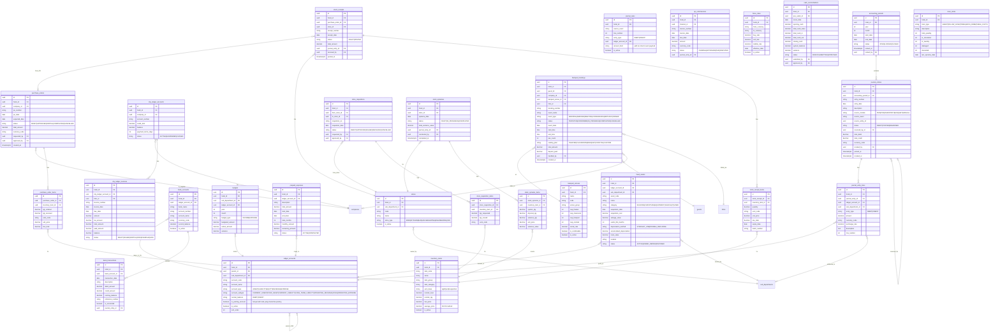

# 05 — ERD Part 3: Alava Accounting + Alava Inventory + Alava Banquet (Foundation)

```mermaid
erDiagram

  %% ════════════════════════════════
  %% ALAVA ACCOUNTING
  %% ════════════════════════════════

  ledger_accounts {
    uuid        id              PK
    uuid        hotel_id        FK
    uuid        parent_id       FK
    uuid        sub_department_id FK
    string      account_code
    string      account_name
    string      account_type    "ASSET|LIABILITY|EQUITY|REVENUE|EXPENSE"
    string      account_subtype "CURRENT_ASSET|FIXED_ASSET|CURRENT_LIABILITY|LONG_TERM_LIABILITY|OPERATING_REVENUE|COGS|OPERATING_EXPENSE"
    string      normal_balance  "DEBIT|CREDIT"
    boolean     is_posting_account "hanya leaf node yang menerima posting"
    boolean     is_active
    int         sort_order
  }

  accounting_periods {
    uuid        id              PK
    uuid        hotel_id        FK
    int         year
    int         month
    date        start_date
    date        end_date
    string      status          "OPEN|LOCKED|CLOSED"
    timestamptz locked_at
    uuid        locked_by       FK
  }

  journal_entries {
    uuid        id              PK
    uuid        hotel_id        FK
    uuid        accounting_period_id FK
    string      entry_number
    date        entry_date
    string      description
    string      source_module   "PMS|POS|INVENTORY|BANQUET|MANUAL"
    string      source_event
    uuid        source_entity_id
    string      status          "DRAFT|POSTED|REVERSED"
    uuid        reversed_by_id  FK
    decimal     total_debit
    decimal     total_credit
    string      currency_code
    uuid        created_by      FK
    timestamptz posted_at
    timestamptz created_at
  }

  journal_entry_lines {
    uuid        id              PK
    uuid        hotel_id        FK
    uuid        journal_entry_id FK
    uuid        ledger_account_id FK
    uuid        sub_department_id FK
    string      entry_type      "DEBIT|CREDIT"
    decimal     amount
    string      currency_code
    decimal     exchange_rate
    text        description
    int         line_number
  }

  journal_rules {
    uuid        id              PK
    uuid        hotel_id        FK
    string      source_event
    int         line_number
    string      entry_type      "DEBIT|CREDIT"
    uuid        ledger_account_id FK
    string      amount_field    "path ke nilai di event payload"
    boolean     is_active
  }

  city_ledger_accounts {
    uuid        id              PK
    uuid        hotel_id        FK
    uuid        company_id      FK
    string      account_number
    decimal     credit_limit
    decimal     balance
    int         payment_terms_days
    string      status          "ACTIVE|SUSPENDED|CLOSED"
  }

  city_ledger_invoices {
    uuid        id              PK
    uuid        hotel_id        FK
    uuid        city_ledger_account_id FK
    uuid        folio_id        FK
    string      invoice_number
    date        invoice_date
    date        due_date
    decimal     amount
    decimal     tax_amount
    decimal     total_amount
    decimal     paid_amount
    decimal     balance
    string      status          "DRAFT|ISSUED|PARTIAL|PAID|OVERDUE|VOID"
  }

  ap_commissions {
    uuid        id              PK
    uuid        hotel_id        FK
    uuid        channel_id      FK
    string      invoice_number
    date        invoice_date
    date        due_date
    decimal     amount
    string      currency_code
    string      status          "PENDING|APPROVED|PAID|DISPUTED"
    uuid        journal_entry_id FK
  }

  bank_accounts {
    uuid        id              PK
    uuid        hotel_id        FK
    uuid        ledger_account_id FK
    string      bank_name
    string      account_number
    string      account_name
    string      currency_code
    decimal     current_balance
    boolean     is_active
  }

  bank_transactions {
    uuid        id              PK
    uuid        hotel_id        FK
    uuid        bank_account_id FK
    date        transaction_date
    string      description
    decimal     debit_amount
    decimal     credit_amount
    decimal     running_balance
    string      reference_number
    boolean     is_reconciled
    uuid        journal_entry_id FK
  }

  budgets {
    uuid        id              PK
    uuid        hotel_id        FK
    uuid        sub_department_id FK
    uuid        ledger_account_id FK
    int         year
    int         month
    string      budget_type     "INCOME|EXPENSE"
    decimal     budgeted_amount
    decimal     actual_amount
    decimal     variance
  }

  forex_rates {
    uuid        id              PK
    uuid        hotel_id        FK
    string      from_currency
    string      to_currency
    decimal     buy_rate
    decimal     sell_rate
    decimal     middle_rate
    date        effective_date
    boolean     is_active
  }

  cash_reconciliations {
    uuid        id              PK
    uuid        hotel_id        FK
    uuid        pos_outlet_id   FK
    date        recon_date
    decimal     opening_cash
    decimal     total_cash_sales
    decimal     total_cash_in
    decimal     total_cash_out
    decimal     closing_cash
    decimal     system_balance
    decimal     variance
    string      status          "DRAFT|SUBMITTED|APPROVED"
    uuid        submitted_by    FK
    uuid        approved_by     FK
  }

  prepaid_expenses {
    uuid        id              PK
    uuid        hotel_id        FK
    uuid        ledger_account_id FK
    string      description
    decimal     total_amount
    date        start_date
    date        end_date
    int         total_months
    decimal     monthly_amount
    decimal     remaining_amount
    string      status          "ACTIVE|COMPLETED"
  }

  %% ════════════════════════════════
  %% ALAVA INVENTORY
  %% ════════════════════════════════

  stores {
    uuid        id              PK
    uuid        hotel_id        FK
    uuid        sub_department_id FK
    string      code
    string      name
    string      store_type      "MAIN|KITCHEN|BAR|HOUSEKEEPING|ENGINEERING|SPA"
    boolean     is_active
  }

  inventory_items {
    uuid        id              PK
    uuid        hotel_id        FK
    string      item_code
    string      name
    string      item_group
    string      item_category
    string      uom_base        "kg|ltr|pcs|box|portion"
    decimal     reorder_level
    decimal     reorder_qty
    decimal     last_price
    decimal     average_price   "AVCO method"
    boolean     is_active
  }

  purchase_orders {
    uuid        id              PK
    uuid        hotel_id        FK
    uuid        company_id      FK
    string      po_number
    date        po_date
    date        expected_date
    string      status          "DRAFT|APPROVED|PARTIAL|COMPLETED|CANCELLED"
    decimal     total_amount
    string      currency_code
    uuid        requested_by    FK
    uuid        approved_by     FK
    timestamptz created_at
  }

  purchase_order_items {
    uuid        id              PK
    uuid        purchase_order_id FK
    uuid        inventory_item_id FK
    decimal     qty_ordered
    decimal     qty_received
    string      uom_code
    decimal     unit_price
    decimal     line_total
  }

  stock_receipts {
    uuid        id              PK
    uuid        hotel_id        FK
    uuid        purchase_order_id FK
    uuid        store_id        FK
    string      receipt_number
    date        receipt_date
    string      status          "DRAFT|POSTED"
    decimal     total_amount
    uuid        journal_entry_id FK
    uuid        received_by     FK
    timestamptz posted_at
  }

  stock_receipt_items {
    uuid        id              PK
    uuid        stock_receipt_id FK
    uuid        inventory_item_id FK
    decimal     quantity
    string      uom_code
    decimal     unit_price
    decimal     line_total
    date        expiry_date
    string      batch_number
  }

  store_requisitions {
    uuid        id              PK
    uuid        hotel_id        FK
    uuid        from_store_id   FK
    uuid        to_store_id     FK
    string      requisition_no
    date        requisition_date
    string      status          "DRAFT|APPROVED|ISSUED|RECEIVED|CANCELLED"
    uuid        requested_by    FK
    uuid        approved_by     FK
  }

  store_requisition_items {
    uuid        id              PK
    uuid        store_requisition_id FK
    uuid        inventory_item_id FK
    decimal     qty_requested
    decimal     qty_issued
    string      uom_code
  }

  stock_opnames {
    uuid        id              PK
    uuid        hotel_id        FK
    uuid        store_id        FK
    date        opname_date
    string      status          "DRAFT|IN_PROGRESS|COMPLETED"
    decimal     total_variance_value
    uuid        journal_entry_id FK
    uuid        conducted_by    FK
    timestamptz completed_at
  }

  stock_opname_items {
    uuid        id              PK
    uuid        stock_opname_id FK
    uuid        inventory_item_id FK
    decimal     system_qty
    decimal     physical_qty
    decimal     variance_qty
    decimal     unit_price
    decimal     variance_value
  }

  %% ════════════════════════════════
  %% ALAVA ASSET
  %% ════════════════════════════════

  fixed_assets {
    uuid        id              PK
    uuid        hotel_id        FK
    uuid        ledger_account_id FK
    uuid        sub_department_id FK
    string      asset_code
    string      name
    string      category        "BUILDING|FURNITURE|EQUIPMENT|VEHICLE|IT|LINEN"
    date        acquisition_date
    decimal     acquisition_cost
    decimal     salvage_value
    int         useful_life_months
    string      depreciation_method "STRAIGHT_LINE|DOUBLE_DECLINING"
    decimal     accumulated_depreciation
    decimal     book_value
    string      location
    string      status          "ACTIVE|UNDER_REPAIR|DISPOSED"
  }

  linen_items {
    uuid        id              PK
    uuid        hotel_id        FK
    string      linen_type      "SHEET|PILLOW_CASE|TOWEL|BATH_ROBE|TABLE_CLOTH"
    string      description
    int         total_quantity
    int         in_circulation
    int         in_laundry
    int         damaged
    int         discarded
    date        last_opname_date
  }

  %% ════════════════════════════════
  %% ALAVA BANQUET — TAHAP 3 FOUNDATION
  %% ════════════════════════════════

  banquet_venues {
    uuid        id              PK
    uuid        hotel_id        FK
    string      name
    string      code
    string      venue_group
    int         cap_theater
    int         cap_classroom
    int         cap_banquet
    int         cap_cocktail
    decimal     rental_rate
    boolean     is_combinable
    boolean     is_active
  }

  banquet_bookings {
    uuid        id              PK
    uuid        hotel_id        FK
    uuid        guest_id        FK
    uuid        company_id      FK
    uuid        banquet_venue_id FK
    uuid        folio_id        FK
    string      booking_number
    string      event_name
    string      event_type      "WEDDING|SEMINAR|MEETING|CONFERENCE|BIRTHDAY|DINNER"
    string      status          "TENTATIVE|CONFIRMED|IN_PROGRESS|COMPLETED|CANCELLED"
    date        event_date
    time        start_time
    time        end_time
    int         pax_count
    string      seating_plan    "THEATER|CLASSROOM|BANQUET|COCKTAIL|CUSTOM"
    decimal     total_amount
    decimal     deposit_paid
    uuid        handled_by      FK
    timestamptz created_at
  }

  %% ════════════════════════════════
  %% ACCOUNTING RELATIONSHIPS
  %% ════════════════════════════════

  ledger_accounts }o--o| ledger_accounts : "parent_child"
  accounting_periods ||--o{ journal_entries : "contains"
  journal_entries ||--o{ journal_entry_lines : "has"
  journal_entries }o--o| journal_entries : "reversed_by"
  journal_entry_lines }o--|| ledger_accounts : "posts_to"
  journal_entry_lines }o--o| sub_departments : "attributed_to"

  city_ledger_accounts }o--|| companies : "for"
  city_ledger_accounts ||--o{ city_ledger_invoices : "has"

  bank_accounts }o--|| ledger_accounts : "maps_to_GL"
  bank_accounts ||--o{ bank_transactions : "records"

  budgets }o--|| ledger_accounts : "tracks"
  prepaid_expenses }o--|| ledger_accounts : "maps_to"

  %% ════════════════════════════════
  %% INVENTORY RELATIONSHIPS
  %% ════════════════════════════════

  stores }o--|| sub_departments : "owned_by"

  purchase_orders }o--|| companies : "to_supplier"
  purchase_orders ||--o{ purchase_order_items : "has"
  purchase_order_items }o--|| inventory_items : "for"

  stock_receipts }o--o| purchase_orders : "from_PO"
  stock_receipts }o--|| stores : "into"
  stock_receipts ||--o{ stock_receipt_items : "has"
  stock_receipt_items }o--|| inventory_items : "for"

  store_requisitions }o--|| stores : "from_store"
  store_requisitions ||--o{ store_requisition_items : "has"
  store_requisition_items }o--|| inventory_items : "for"

  stock_opnames }o--|| stores : "for"
  stock_opnames ||--o{ stock_opname_items : "has"
  stock_opname_items }o--|| inventory_items : "counts"

  fixed_assets }o--|| ledger_accounts : "booked_to"
  fixed_assets }o--|| sub_departments : "owned_by"

  %% ════════════════════════════════
  %% BANQUET RELATIONSHIPS
  %% ════════════════════════════════

  banquet_bookings }o--|| banquet_venues : "at"
  banquet_bookings }o--|| guests : "for"
  banquet_bookings }o--o| companies : "billed_to"
  banquet_bookings }o--|| folios : "billed_via"
```
